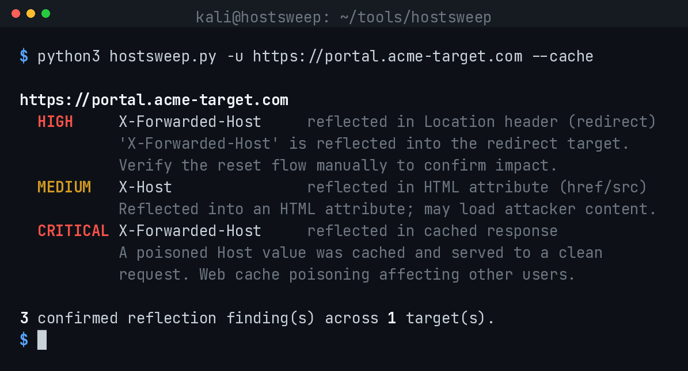

# HostSweep

A Host header injection scanner focused on accurate, confirmation-based detection.

HostSweep tests whether a web application trusts client-supplied host information
and reflects it into a security-relevant location. It reports a finding only when
an injected canary value is provably reflected in the response, which keeps false
positives low enough to use the results directly in an engagement.



## Detection approach

Each candidate header is injected with a unique canary value. A finding is
recorded only when that exact canary appears in the response — in the redirect
target, an HTML attribute, the response body, or a `Set-Cookie` value. Reflection
is treated as confirmation; indirect or behavioural signals are reported
separately and never counted as confirmed findings.

Scanning runs in two passes:

1. **Triage.** All candidate headers are sent in a single request, each carrying a
   distinct canary. The canary that is reflected identifies exactly which header
   the server trusts, using only one request.
2. **Confirmation.** Every header that reflected during triage is re-tested in
   isolation, with a fresh canary, to rule out interference from sending multiple
   headers at once. Only headers that reflect again are reported.

## Headers tested

`X-Forwarded-Host`, `X-Forwarded-Server`, `X-Host`, `X-HTTP-Host-Override`,
`X-Original-Host`, `X-Original-URL`, `X-Rewrite-URL`, `Forwarded`,
`X-Forwarded-For`, and a spoofed `Host` value.

## Severity model

| Reflected in | Severity | Rationale |
|--------------|----------|-----------|
| Redirect `Location` | High | Open redirect; potential password-reset poisoning |
| `Set-Cookie` domain | High | Cookie scoping or fixation |
| HTML attribute (`href`/`src`/`action`) | Medium | May load attacker-controlled content |
| Response body | Medium | Confirm the value reaches a security-relevant sink |
| Cached response (with `--cache`) | Critical | Web cache poisoning affecting other users |

Behavioural changes with a spoofed Host but no reflection are reported as notes
for manual review, not as confirmed findings.

## Installation

```
git clone https://github.com/suhelkathi/hostsweep
cd hostsweep
pip install -r requirements.txt
```

## Usage

```
# single target
python3 hostsweep.py -u https://target.com

# authenticated test
python3 hostsweep.py -u https://target.com/account -c "session=..."

# scan a list, include the cache poisoning check, export JSON
python3 hostsweep.py -l hosts.txt --cache --json results.json

# route through Burp
python3 hostsweep.py -u https://target.com -k --proxy http://127.0.0.1:8080
```

## Options

| Flag | Description |
|------|-------------|
| `-u` / `-l` | single URL or file of URLs |
| `-c` | Cookie header for authenticated scans |
| `-H` | additional request header, repeatable |
| `--cache` | run the web cache poisoning check |
| `-t` | concurrency (default 15) |
| `--proxy` | send traffic through a proxy such as Burp |
| `-k` | skip TLS verification |
| `--json` / `--csv` | machine-readable output |
| `--only-vuln` | show only High/Critical findings |

The process exits with code 2 when any High or Critical finding is present, which
is convenient for CI pipelines.

## Manual confirmation

```
curl -s -I https://target.com \
  -H "X-Forwarded-Host: canary.example.com" | grep -i location
```

If the injected host appears in the `Location` header or in generated links, the
application trusts client-supplied host information. For reset-poisoning impact,
trigger the password reset flow and inspect the resulting link.

## Scope and limitations

Reflection confirms that a header is trusted, but not every reflection is
independently exploitable. High-impact cases such as password-reset poisoning
require out-of-band verification (for example, reading the reset email), which an
automated scanner cannot observe. HostSweep is designed to surface confirmed
reflections precisely and leave that final verification to the tester.

## Legal

Use only against systems you are explicitly authorised to test.

© 2026 Suhel Kathi. Released under the MIT License.

## License

MIT
